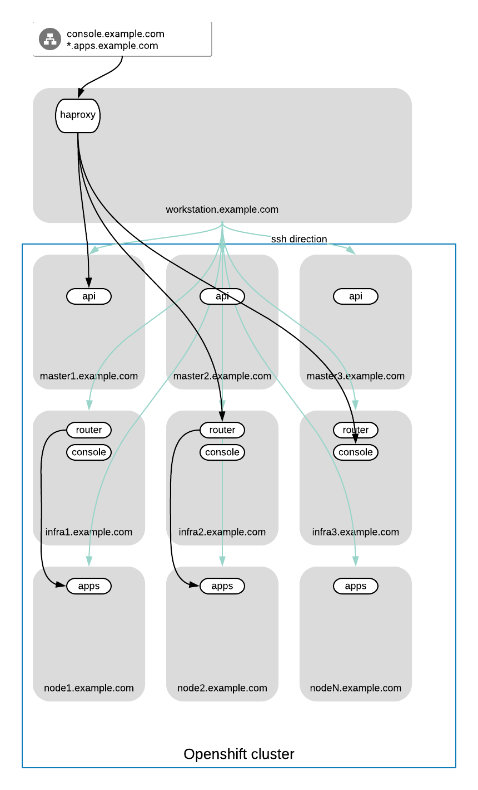
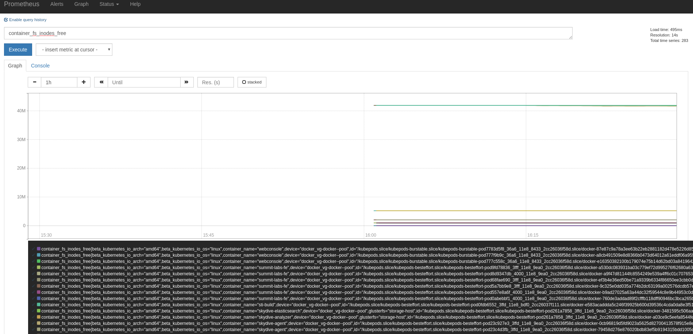
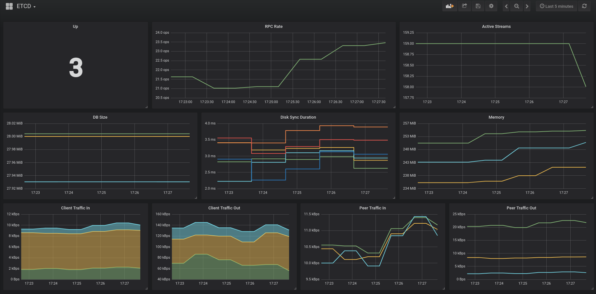

# Effectively monitor and troubleshoot your Openshift Cluster 

## Overview

Short description: Monitor your Openshift cluster in an effective way.

Long description: During this session, the attendees will learn the key concepts around effectively monitoring a Production OpenShift Cluster and the best techniques to troubleshoot different issues with both the platform and the running containers. We will create different scenarios (real issues we have dealt with on different enterprise customers these years) and we will see how the monitoring tools handle those errors and how we can troubleshoot them to get our services back to production state.


. This demonstration showcases the following:

* Recovering from etcd failures in real operational cluster.
* Debug and recovery from failed build due infrastructure and build problems.
* Debug and recover from Openshift scheduler issues. 
* Debug and recover from binary build issues and deployments.

. Goal

* To learn how we can effectively monitor our openshift cluster and proactively solve issues.
* Lear how to debug and operate openshift cluster

. Prerequisites

* Understanding of openshift concepts and working principals. 

Current versions of products used:

|Product |Version |
--------- | --------- |
|`OpenShift Container Platform` |`3.7/3.9`
|`Container Native Storate` |`3.3`
|`Grafana` |
|`Prometheus` |
|`Alertmanager` |

### Environment

The demo environment consists of the following systems:


|Hostname              |Internal IP    |Description |
---------------------- | -------------- | --------------- |
|`bastion.example.com` |`192.168.0.5`  | Bastion host/Loadbalancer
|`master1.example.com`  |`192.168.0.11` | Master 1
|`master2.example.com`  |`192.168.0.12` | Master 2
|`master3.example.com`  |`192.168.0.13` | Master 3
|`infra1.example.com`  |`192.168.0.21` | Infra 1
|`infra2.example.com`  |`192.168.0.22` | Infra 2
|`infra3.example.com`  |`192.168.0.23` | Infra 3
|`node1.example.com`  |`192.168.0.31` | Node 1
|`node2.example.com`  |`192.168.0.32` | Node 2
|`node3.example.com`  |`192.168.0.33` | Node 3


NOTE: HAProxy is running on the *workstation* machine.  This provides a level of port forwarding to allow access to the OpenShift console and other services running on OpenShift to overcome some DNS and routing limitations in the underlying Ravello environment.  This includes port 80, 8443 and 8080-8085.



You can ssh from bastion to any node from `root` to `root`.

When you ssh to lab using `lab-user`, you can `sudo su -` to get `root` access.

Your environment contains few application, which will help you to know your cluster state.

#### Prometheus

Prometheus will scrape endpoints all over the environment and raises the alerts based on rules. Those alerts are passed to alertmanager for next distribution.




#### Alertmanager

Alertmanager is used to aggregate alerts and dispatch them to the required delivery destination.


#### Grafana 

Grafana is used to graphically represent cluster data. It interacts directly with prometheus as datasource.

 


### Provision Your Demo Environment

. If you have Red Hat Product Demo System access, log in to the link:https://rhpds.redhat.com/[Red Hat Product Demo System] with your SSO credentials.

. Go to *Services -> Catalogs -> Service Catalogs*.

. Under *All Services -> AppDev in the Cloud*, select *Effectively monitor and troubleshoot your OCP Cluster*.

. On the right, click *Order*.

. Read all of the information on the resulting page, check the necessary box, and click *Submit*.

[IMPORTANT]
====
* It takes about 15-20 minutes for the demo to load completely and become accessible.
** Wait for the full demo to load, even if some of its systems are marked "Up."
* Watch for an email with information about how to access your demo environment.
** Make note of the email's contents: a list of hostnames, IP addresses, and your GUID.
** Whenever you see GUID in the demo instructions, replace it with the GUID provided in the email.
* You can get real-time updates of your demo environment at https://www.opentlc.com/rhpds-status.
====


[TIP]
-----
Be mindful of the runtime of your demo environment! It may take you longer than the 3 hours allotted to complete the demo, so you may need to extend the runtime. This is especially important in later steps when you are building virtual machines. For information on how to extend runtime and lifetime, see https://www.opentlc.com/lifecycle.

## Getting Started

. From a web browser, open URL below in its own window or tab, using `admin` for the username and `r3dh4t1!` for the password:

* *OpenShift console:* `https://console-<YOUR-GUID>.rhpds.opentlc.com:`


[TIP]
You can also find these URLs in the email you received when you provisioned the demo environment.


## Review the Environment

. Once the OpenShift environment is up and running, log in to the *OpenShift Enterprise Console* at `https://console-<YOUR-GUID>.rhpds.opentlc.com/console`, using these credentials:
+
* *Username*: `admin`
* *Password*: `r3dh4t1!`

If nothing is running on your cluster, give it some time. There is background service running, which is populating your cluster.

### Lab Launcher

Lab is being launched using command `lab`. It can be used only from the bastion host.
Example:
```
[root@workstation-repl summit]# lab -l
INFO[0000] Starting Wrapper                             
---------------------------------------------------------------------
Scenario 0
Description: Observe ETCD state and recover when quorum is lost. Simulate 2 DC deployment.
Actions: [init, solve, break1, break2]
To init this scenario execute:
  cli -s 0 -a init

---------------------------------------------------------------------
Scenario 1
Description: Observe ETCD - Bonus task
Actions: [init, solve]
To init this scenario execute:
  cli -s 1 -a init
...
```

### CLI access

Once environment is bootstrapped you should see all the welcome screen url replaces with the values:
```
Information about Your current environment:
Your GUID: repl
OCP WEB UI access via IP: console.example.com
Wildcard FQDN for apps: apps.example.com

Infrastructure:                                                       
    3 x Masters/Etcd   - master[1-3].example.com                      
    3 x Infra/Gluster  - infra[1-3].example.com                       
    3 x Nodes          - node[1-3].example.com                        

SSH user: root                                                        
Proxy command:                                                        
    ssh -D 8080 -C -N root@workstation-repl.rhpds.opentlc.com                                                                                                      

Pre-Deployed apps:                                                    
    https://prometheus.apps.example.com
    https://grafana.apps.example.com
    https://alertmanager.apps.example.com
```

You can get this windows again by executing `lab -h`


You have pre-deployed application available for you, go and inspect them.

Core tools we will be using in this labs are supported by Red Hat. Few other non-core ones are with community support. 

Lab consist of number scenarios. They are independent, but we dont recommend to jump from one scenario to other without finishing previous one.

All scenarios has few parts. 
`part 1`   - Documentation and explanation of the scenario.
`solution part 1` - Solution of the scenario.
`appendix`- Materials, for further reading,

## Scenarios:
### [S0: ETCD Quorum and recovery](./scenario0/part1.md)
### [S1: ETCD Performance degradation](./scenario1/part1.md)
### [S2: Builds](./scenario2/part1.md)
### [S3: Scehduler](./scenario3/part1.md)
### [S4: Binary Builds](./scenario4/part1.md)
### [S5: SDN](./scenario5/part1.md)

Individual scenarios documentation is in its own documentation pages. 
