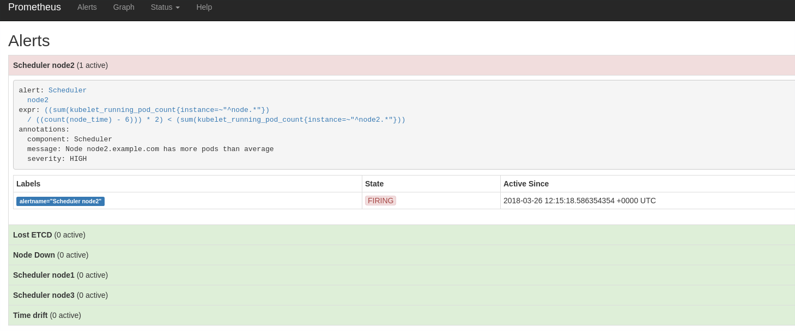

### Problem to solve

```
Complexity: Medium
Length: 10-20 min
Dashboard: Labs Generic
```

In this scenario we will learn basics how openshift scheduler and limits works and how it can impact your platforms behaviour and performance. And why you should care about your scheduler behaviour.

To start this scenario execute command on the bastion:
```
lab -s 3 -a init
```

You should have new project created in your cluster named `scheduler`. Go and investigate it.

```
oc project scheduler
oc get pods

#output example
oc get pods
NAME                      READY     STATUS    RESTARTS   AGE
hello-openshift-1-kfgtg   1/1       Running   0          2m
```

Now lets scale this app to replica 5:
```
oc scale dc/hello-openshift --replicas=5
```

Everything looks fine from the first sight.
```
oc get pods
NAME                      READY     STATUS    RESTARTS   AGE
hello-openshift-1-5vvj2   1/1       Running   0          23s
hello-openshift-1-9q6jh   1/1       Running   0          23s
hello-openshift-1-f9ngm   1/1       Running   0          23s
hello-openshift-1-kfgtg   1/1       Running   0          3m
hello-openshift-1-krx58   1/1       Running   0          23s
```

But lets check deeper. In your case it might be little bit different.
```
oc get pods -o wide
NAME                      READY     STATUS    RESTARTS   AGE       IP            NODE
hello-openshift-1-9b5gl   1/1       Running   0          21s       10.131.1.29   node1.example.com
hello-openshift-1-hwp9g   1/1       Running   0          31s       10.131.1.28   node1.example.com
hello-openshift-1-kczrg   1/1       Running   0          21s       10.131.1.32   node1.example.com
hello-openshift-1-v6jk5   1/1       Running   0          21s       10.131.1.31   node1.example.com
hello-openshift-1-v9vdt   1/1       Running   0          21s       10.131.1.30   node1.example.com
```

We dont see pod distribution. Lets scale more to check more...

```
oc scale dc/hello-openshift --replicas=15
```

You should see the same result. So whats happening?

First our scheduler does not know how to spread pods over the worker nodes.
Second, our pid does not have any limits, so again, scheduler does not know "how big is the pod" so it does not know when node is full.

Dashboards and alerts:




Task 1: Identify why pods are not being spread around the 3 worker nodes.
For this solution DO NOT modify default scheduler or master configs. Everything should be done on the project and node labeling level.

Useful commands:
```
oc label nodes -l label=value - label nodes
oc get nodes --show-labels - check labels
[root@master1 ~]# cat /etc/origin/master/scheduler.json - check scheduler
oc edit namespace scheduler - modify namespace
```

### Solution

Lets see how we can find these things. First lets check what kind of labels we have on the nodes:
```
oc get nodes --show-labels
...
node1.example.com     Ready                      7d        v1.7.6+a08f5eeb62   ...,region=r1,zone=az1
node2.example.com     Ready                      7d        v1.7.6+a08f5eeb62   ...,region=r2,zone=az1
node3.example.com     Ready                      7d        v1.7.6+a08f5eeb62   ...,region=r3,zone=az1
```

We have zone and different regions. Check the project selector for any default selector:
```
oc get project scheduler -o yaml
...
    openshift.io/node-selector: zone=az1
...

```

So following this logic, it should spread all the pods all over the nodes. But it does not. Other place where you might look into this is other node utilisation.
```
[root@workstation-REPL summit-labs-ansible-wrapper]# oc describe node node1.example.com
...
Capacity:
 cpu:           8
 memory:        8009640Ki
 pods:          254
Allocatable:
 cpu:           7
 memory:        5097013760
 pods:          254

...

Non-terminated Pods:                    (5 in total)
  Namespace                             Name                                    CPU Requests    CPU Limits      Memory Requests Memory Limits
  ---------                             ----                                    ------------    ----------      --------------- -------------
  coolstore                             cart-1-865sr                            0 (0%)          0 (0%)          200Mi (4%)      1Gi (21%)
  coolstore                             inventory-1-nqhpc                       0 (0%)          0 (0%)          512Mi (10%)     1Gi (21%)
  coolstore                             rating-mongodb-1-deploy                 0 (0%)          0 (0%)          0 (0%)          0 (0%)
  coolstore                             web-ui-1-ch4ff                          0 (0%)          0 (0%)          0 (0%)          0 (0%)
  openshift-metrics-node-exporter       prometheus-node-exporter-j64wz          100m (1%)       200m (2%)       30Mi (0%)       50Mi (1%)
Allocated resources:
  (Total limits may be over 100 percent, i.e., overcommitted.)
  CPU Requests  CPU Limits      Memory Requests Memory Limits
  ------------  ----------      --------------- -------------
  100m (1%)     200m (2%)       742Mi (15%)     2098Mi (43%)
Events:         <none>

```

Again from this output we can see that node1 is not utilized. And we have resources available in `Allocatable` section. Worth mentioning that `QoS` is in place and you should be aware how it works. Very good reading about this: https://blog.openshift.com/managing-compute-resources-openshiftkubernetes/

So if you do describe on the node where all our `hello-openshift` pods are running you can see that our pods has no limits and quotas:
```
  scheduler                             hello-openshift-1-28rbl                 0 (0%)          0 (0%)          0 (0%)          0 (0%)
  scheduler                             hello-openshift-1-4dsnb                 0 (0%)          0 (0%)          0 (0%)          0 (0%)
  scheduler                             hello-openshift-1-7l7bv                 0 (0%)          0 (0%)          0 (0%)          0 (0%)
  scheduler                             hello-openshift-1-86s6g                 0 (0%)          0 (0%)          0 (0%)          0 (0%)
  scheduler                             hello-openshift-1-8828n                 0 (0%)          0 (0%)          0 (0%)          0 (0%)
  scheduler                             hello-openshift-1-8d6lj                 0 (0%)          0 (0%)          0 (0%)          0 (0%)
  scheduler                             hello-openshift-1-8lgvb                 0 (0%)          0 (0%)          0 (0%)          0 (0%)
  scheduler                             hello-openshift-1-bdmtj                 0 (0%)          0 (0%)          0 (0%)          0 (0%)
  scheduler                             hello-openshift-1-bnjmw                 0 (0%)          0 (0%)          0 (0%)          0 (0%)
```

So if you read throuth link about managing compute resources you will know that this pod is running in a `Best-Effort` QoS. So this is not good, but we will not go into solving this. We are intrested why pods are not being spread.

Last place we need to check if Kubernetes scheduler:

Now ssh to any master and check the file:
```
ssh master1.example.com
cat /etc/origin/master/scheduler.json
{
    "apiVersion": "v1",
    "kind": "Policy",
    "predicates": [
       ....
        {
            "argument": {
                "serviceAffinity": {
                    "labels": [
                        "region"
                    ]
                }
            },
            "name": "Region"
        }
    ],
    "priorities": [
      ...
        {
            "argument": {
                "serviceAntiAffinity": {
                    "label": "zone"
                }
            },
            "name": "Zone",
            "weight": 2
        }
    ]
}
```

More on scheduler configuration you can find in Openshift documentation[1].

So what we can see from this file?

Our nodes has labels `zone=az1` and `region=r1,r2,r3`. And based on these labels our scheduler is doing:
`serviceAntiAffinity` based on `zone` label: try to spread services as much as you can within the zone.
`serviceAffinity` based on `region` label: try to keep all service as close as possible within region.

Those rules are not "hard" rules, if limits and quotas are set. When those are set scheduler knows when node is full, and can schedule pods to other nodes.
In our case `QoS` set as `Best-Effort` does not give any information about it.

Lets see how we can fix those. We will not modify our scheduler, because it could impact other application running on the platform. But our nodes labels are broken.
In big cluster subset of nodes could be ring-fenced for particular purpose, and those labels could not match scheduler rules.

Lets relabel our nodes:
```
oc label nodes node1.example.com region=workers --overwrite
oc label nodes node2.example.com region=workers --overwrite
oc label nodes node3.example.com region=workers --overwrite
oc label nodes node1.example.com zone=az1 --overwrite
oc label nodes node2.example.com zone=az2 --overwrite
oc label nodes node3.example.com zone=az3 --overwrite
```

Next, lets remove default node selector from the project as not it is not needed:

```
oc edit namespace scheduler
#remove line
openshift.io/node-selector: zone=az1
```

If default node selector is not defined on the project level, it being used from openshift master config:
```
ssh master1.example.com
[root@master1 ~]# cat /etc/origin/master/master-config.yaml | grep defaultNodeSelector
  defaultNodeSelector: region=workers
```

Now lets delete our pods and check again:

```
oc project scheduler
oc delete pod --all
```

After old pods get deleted and new created check how they are spread again:
```
oc get pods -o wide
```
You should see spread all over 3 nodes now, because `serviceAntiAffinity` is based on zone label, so scheduler is trying to spread pods around.


When you done with the scenario, execute command on bastion host:

```
lab -s 3 -a solve
```

### Appendix

#### Materials used in the scenario

1. Openshift Scheduler explained:
https://docs.openshift.com/container-platform/3.9/admin_guide/scheduling/scheduler-advanced.html#admin-guide-scheduling-advanced

2. OpenShift Resource managment:
https://blog.openshift.com/managing-compute-resources-openshiftkubernetes/


### [**-- HOME --**](https://rht-labs-events.github.io/summit-lab-2018-doc/)