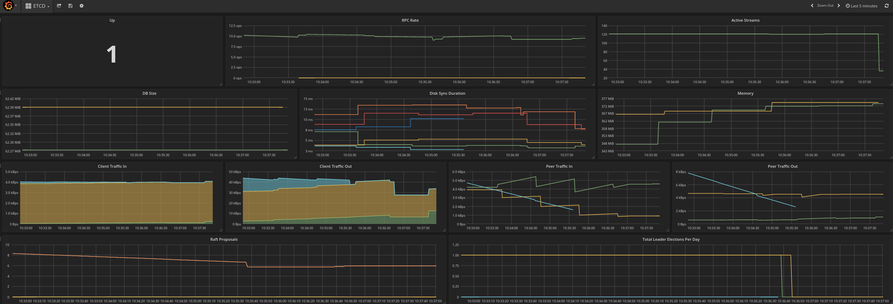

### Problem to solve

```
Complexity: High
Length: 20-30 min
Dashboard: ETCD
```

In this lab we will see how loss of the quorum can impact Platforms behaviour and how we can recover from it for the time being. And will advise on material for future readings when planning real life DR situations.

etcd stores the persistent master state while other components watch etcd for changes to bring themselves into the desired state. etcd can be optionally configured for high availability, typically deployed with 2n+1 peer services.

In this lab etcd runs together on masters. Before starting open Grafana dashboard `ETCD` and inspect monitoring data from our etcd cluster.

You should see something like this:


At the same time open prometheus url and check alerts tab for any active alerts. At this point if the environment is functioning properly, you should see no alerts firing.


We can check etcd manually via command from the master or any remote host which has the certificates. If you chose to do this from other host than master in your infrastructure, make sure you apply appropriate security mitigation to this host, as you are "leaking" platforms certificates outside the ring fenced hosts.

If you dont have dashboards and alerting tools in place, next big thing when it comes to debugging is `etcdctl` utility. Lets check how we can use it.

ssh to one of the master hosts:
```
ssh root@master1.example.com
```

execute a command to check etcd health status. This command will give you each endpoint health status. 
```
[root@master1]# docker exec -it etcd_container sh -c "ETCDCTL_API=3 etcdctl --cert=/etc/etcd/peer.crt --key=/etc/etcd/peer.key --cacert=/etc/etcd/ca.crt --endpoints="[https://192.168.0.11:2379,https://192.168.0.12:2379,https://192.168.0.13:2379]" endpoint status -w table"

#Output example:
+---------------------------+------------------+---------+---------+-----------+-----------+------------+
|         ENDPOINT          |        ID        | VERSION | DB SIZE | IS LEADER | RAFT TERM | RAFT INDEX |
+---------------------------+------------------+---------+---------+-----------+-----------+------------+
| https://192.168.0.11:2379 | b2fc96740d4db02e |  3.2.15 |   65 MB |      true |       964 |    1121049 |
| https://192.168.0.12:2379 | 3eea3b05deae6cbc |  3.2.15 |   65 MB |     false |       964 |    1121051 |
| https://192.168.0.13:2379 | 509718481af2e12e |  3.2.15 |   65 MB |     false |       964 |    1121051 |
+---------------------------+------------------+---------+---------+-----------+-----------+------------+
```

In this table we can see current etcd status. Which node is the leader, database size, version, unique ID, raft term, raft index. 
`Raft Term` is an integer that will increase whenever an etcd master election happens in the cluster. If this number is increasing rapidly, you may need to tune the election timeout. 
`Raft Index` - This is more complex, but you can think about this one as "data consistency" metrics. Those should be equal on all replicas (or very small difference).


Now more generic health command:

```
[root@master1]# docker exec -it etcd_container sh -c "ETCDCTL_API=3 etcdctl --cert=/etc/etcd/peer.crt --key=/etc/etcd/peer.key --cacert=/etc/etcd/ca.crt --endpoints="[https://192.168.0.11:2379,https://192.168.0.12:2379,https://192.168.0.13:2379]"  endpoint health -w table"

###Output:
https://master2.example.com:2379 is healthy: successfully committed proposal: took = 6.889365ms
https://master3.example.com:2379 is healthy: successfully committed proposal: took = 9.472592ms
https://master1.example.com:2379 is healthy: successfully committed proposal: took = 5.291873ms
```

One more useful command is to list all the keys and data in the etcd. In this example we get one of the templates:
```
docker exec -it etcd_container sh -c "ETCDCTL_API=3 etcdctl --cert=/etc/etcd/peer.crt --key=/etc/etcd/peer.key --cacert=/etc/etcd/ca.crt --endpoints="[https://192.168.0.11:2379,https://192.168.0.12:2379,https://192.168.0.13:2379]"  get /openshift.io/templates/openshift/datagrid65-postgresql --prefix"
```


:exclamation: Important Note:

*_Openshift consumes etcd as external service. There are scenarios when despite the fact that etcd show healthy status, cluster will not be working. This usually happens when cluster looses conectivity to the etcd cluster. This might happen because of firewalls, certificates or any other reason. For this reason you should always smoke test your cluster with "noise makers" to make sure you can use mutating API calls_*


Manual command are useful if ETCD goes to Read-Only mode (when quorum is lost) we might lose nice UI monitoring features of the platform as some of those tools uses mutating api calls, and are changing platform. Those requires healthy etcd cluster.

Now lets see what would happen if we lose one etcd node. 

Execute from the bastion:

```
lab -s 0 -a break1
```

In a few seconds you should see that grafana reports that only 2 etcd are alive.

Check prometheus and alertmanager for any alerts.

We can see now lost etcd alert in prometheus and alertmanager:


If you execute same `etcdctl` command on the masters again, you will see this represented in the output too.

Our platform still performs fine, as we have quorum available. Now lets see what will happen when we remove second node from the pool. Note, grafana dashboard will stop showing graphs. This is expected as Grafana uses mutable queries to the openshift api. And without quorum all api is responding is read-only.

Execute from the bastion:

```
lab -s 0 -a break2
```

Now you should see "hell break loose" in the all dashboards.




This is very common scenario in the deployments where you have only 2 datacenters. In this architecture one of the possible deployment ways is that you will need to split your quorum system in 2. Which means if you loose one datacenter, you lost quorum. This is just one of the possible architecture for Openshift. We always recommend to split 3 masters/etcd in 3 availability zones. But this is not always possible.

#### Lab goal

When doing Task 1 of this scenario you should not do anything with master2 and master3. Assume you lost them and your platform have to be recovered using ONLY master1.

Task 1: Put master1 ETCD process (etcd_container) to run as `single-node-cluster` so cluster could work using one node etcd. When done, make sure that your Openshift cluster behaves fine with one etcd.

Task 2: Now lets assume you got master2 and master3 back. You should add master2 ETCD and master3 ETCD to the existing cluster of master1.
This will involve adding new member to the master1 cluster and reconfiguring master2 and master3 to join this cluster.

If you want to skip these task, execute on the *bastion*
```
 lab -s 0 -a solve
```

Useful commands for this lab:

```
journalctl -fu <service_name> - follow logs of the service
ansible all/masters/infras/ -m shell -a "hostname" - execute adhoc command on subset of servers
```

### Solution

#### Recovery

##### Task 1 solution

Lets assume you need to bring platform to the usable state, but you still dont have second datacenter available. For this we can switch single surviving etcd node to the single master configuration. And when surviving etcd becomes available for us, we can add them back to the cluster.

Switch master1/etcd1 to single master mode:

ssh to master1:
```
ssh master1.example.com
```
Force new cluster from 1 etcd node:
```
[root@master1]# sed -i '/ExecStart=/s/$/  --force-new-cluster/' /etc/systemd/system/etcd_container.service
[root@master1]# systemctl daemon-reload
[root@master1]# systemctl restart etcd_container

#Check logs of the container
journalctl -fu etcd_container
```

Recovery might take up to few minutes. But you should see platform getting to better shape now.


All other operations should get back to normal. We just told master1 (surviving etcd node) to "start new cluster with existing data". You can check builds in ci-cd namespace. They should be starting again.

##### Task 2 solution

Now lets assume you got your second DC back. But etcd cluster is now out of sync. We need to create new cluster, by adding 2 lost etcd to the survivor as new members.

Remove `--force-new-cluster` flag from member one.
ssh to master1:
```
ssh master1.example.com
```
re-edit the `/etc/systemd/system/etcd_container.service` file and remove the --force-new-cluster option:
```
[root@master1]# sed -i '/ExecStart/s/ --force-new-cluster//' /etc/systemd/system/etcd_container.service
[root@master1]# systemctl show etcd_container.service --property ExecStart --no-pager

ExecStart=/bin/bash -c "GOMAXPROCS=$(nproc) /usr/bin/etcd"
```

At this point etcd still runs with old systemd.

```
[root@master1]# systemctl daemon-reload
[root@master1]# systemctl restart etcd_container
```
Check etcd 1 member list:
```
[root@master1]# docker exec -it etcd_container sh -c "ETCDCTL_API=3 etcdctl --cert=/etc/etcd/peer.crt --key=/etc/etcd/peer.key --cacert=/etc/etcd/ca.crt --endpoints="[https://192.168.0.11:2379,https://192.168.0.12:2379,https://192.168.0.13:2379]" member list"

b2fc96740d4db02e, started, master1.example.com, https://192.168.0.11:2380, https://192.168.0.11:2379
```

Add member 2:
```
[root@master1]#  docker exec -it etcd_container sh -c "ETCDCTL_API=3 etcdctl --cert=/etc/etcd/peer.crt --key=/etc/etcd/peer.key --cacert=/etc/etcd/ca.crt --endpoints="[https://192.168.0.11:2379,https://192.168.0.12:2379,https://192.168.0.13:2379]" member add master2.example.com --peer-urls="https://192.168.0.12:2380""

Member 8d13245ff0d59b2b added to cluster 447e150364ce5cc3

ETCD_NAME="master2.example.com"
ETCD_INITIAL_CLUSTER="master2.example.com=https://192.168.0.12:2380,master1.example.com=https://192.168.0.11:2380"
ETCD_INITIAL_CLUSTER_STATE="existing"
```
Save these variables somewhere. We will need them in a second.

Now ssh to master2 and update main etcd details with these variables:

:exclamation: *Remove double quotes from the output when updating etcd config file. systemd and etcd does not like them*

```
ssh master2.example.com
```

Update etcd configuration:
```
[root@master2 ~]# vi /etc/etcd/etcd.conf
ETCD_NAME=master2.example.com
ETCD_INITIAL_CLUSTER=master2.example.com=https://192.168.0.12:2380,master1.example.com=https://192.168.0.11:2380
ETCD_INITIAL_CLUSTER_STATE=existing
```

remove old member data:
```
[root@master2 ~]# rm -rf /var/lib/etcd/member
```

start etcd container
```
systemctl start etcd_container
```

:exclamation: *If you see something like error below, you potentially didnt removed quotes in the etcd config file*
```
Mar 31 16:31:35 master2.example.com etcd_container[14625]: 2018-03-31 20:31:35.854136 W | pkg/netutil: failed resolving host master2.example.com:2380" (address tcp/2380": unknown port); retrying in 1
```

Check logs `journalctl -fu etcd_container`

Member list on master1 should show you now 2 running members:
```
[root@master1 ~]# docker exec -it etcd_container sh -c "ETCDCTL_API=3 etcdctl --cert=/etc/etcd/peer.crt --key=/etc/etcd/peer.key --cacert=/etc/etcd/ca.crt --endpoints="[https://192.168.0.11:2379,https://192.168.0.12:2379,https://192.168.0.13:2379]" member list"
4f1716f1da0e8dd9, started, master2.example.com, https://192.168.0.12:2380, https://192.168.0.12:2379
b2fc96740d4db02e, started, master1.example.com, https://192.168.0.11:2380, https://192.168.0.11:2379
```


Repeate same for master3:

on master1:
```
[root@master1 ~]# docker exec -it etcd_container sh -c "ETCDCTL_API=3 etcdctl --cert=/etc/etcd/peer.crt --key=/etc/etcd/peer.key --cacert=/etc/etcd/ca.crt --endpoints="[https://192.168.0.11:2379,https://192.168.0.12:2379,https://192.168.0.13:2379]" member add master3.example.com --peer-urls="https://192.168.0.13:2380""

Member ffcc8fc41a1321d7 added to cluster 447e150364ce5cc3

ETCD_NAME="master3.example.com"
ETCD_INITIAL_CLUSTER="master2.example.com=https://192.168.0.12:2380,master3.example.com=https://192.168.0.13:2380,master1.example.com=https://192.168.0.11:2380"
ETCD_INITIAL_CLUSTER_STATE="existing"
```

Change to master3:
```
ssh master3.example.com
```

Update etcd configuration:
```
[root@master3 ~]# vi /etc/etcd/etcd.conf
ETCD_NAME=master3.example.com
ETCD_INITIAL_CLUSTER=master2.example.com=https://192.168.0.12:2380,master3.example.com=https://192.168.0.13:2380,master1.example.com=https://192.168.0.11:2380
ETCD_INITIAL_CLUSTER_STATE=existing
```

remove old member data:
```
[root@master3 ~]# rm -rf /var/lib/etcd/member
```
start container
```
[root@master3 ~]# systemctl start etcd_container
```

Now check again cluster health with command from the beginning of the scenario.

This was simple failure and recover scenario, where old nodes was available for us. We have ansible playbooks to do all these things for you. If nodes are lost unrecoverably, there is addition steps involved to generate new certificates and distribute them. But this is out of scope for this lab.

Now you should see all 3 ETCD back online in Grafana and no alerts in prometheus. If this is not a case - call instructor :)

### Appendix

#### Materials used in the scenario

Openshift Documentation on ETCD recovery: 
https://docs.openshift.com/container-platform/latest/admin_guide/backup_restore.html

Grafana dashboard and Prometheus alert rules: TODO: GitHub url to dashboards and alertmanager

Etcd (v2) admin guide:
https://coreos.com/etcd/docs/latest/v2/admin_guide.html 
