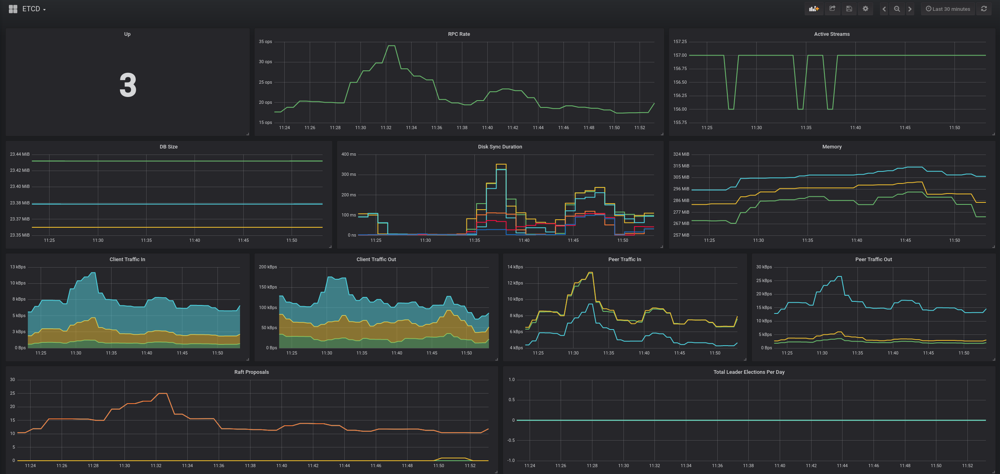
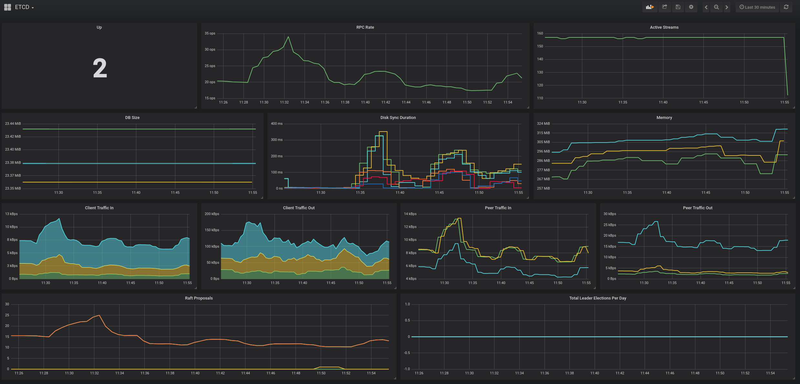
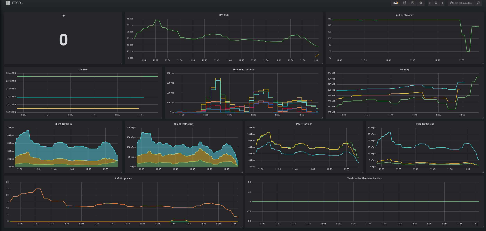
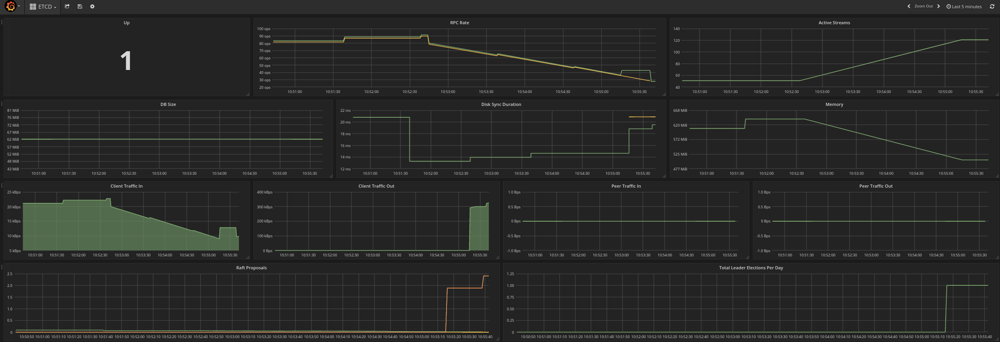

### Problem to solve

```
Complexity: High
Length: 20-30 min
Dashboard: ETCD
```

### Intro

In this lab we will see how loss of the [etcd](https://coreos.com/etcd/docs/latest/faq.html) cluster quorum can impact the OpenShift Container Platforms behaviour and how we can recover from it. We will also provide pointers to material for future readings when planning real life DR situations.

`etcd` stores the persistent OpenShift Container Platform (OCP) master state while other components watch `etcd` for changes to bring themselves into the desired state. `etcd` can be optionally configured for high availability, typically deployed with 2n+1 peer services. For further details, you can read the `What is failure tolerance?` section of [this page](https://coreos.com/etcd/docs/latest/faq.html) at your own leisure.

In this lab `etcd` runs co-hosted with the OpenShift Container Platform (OCP) masters. Before you start, open the Grafana dashboard `ETCD` and inspect monitoring data for the `etcd` cluster.

You should see something like this:



Also open the prometheus url and check the alerts tab for any active alerts. At this point, if the environment is functioning properly, you should see no alerts.


The state of the `etcd` cluster, can be manually checked via CLI commands on the OCP master - or any remote host which has the OCP certificates available for use.

:exclamation: Important Note:

*_If you chose to use a remote host, make sure you apply appropriate security measurements to the host, as you are "leaking" OCP certificates outside of the cluster._*

If you do not have dashboards and alerting tools in place, next best tool for debugging is `etcdctl` utility. Let us take a closer look at how it can be used:

First, ssh to one of the OCP master hosts:

```
> ssh root@master1.example.com
```

Execute the following command to check the `etcd` cluster's health status:

```
> docker exec -it etcd_container sh -c "ETCDCTL_API=3 etcdctl \
  --cert=/etc/etcd/peer.crt --key=/etc/etcd/peer.key --cacert=/etc/etcd/ca.crt \
  --endpoints="[https://192.168.0.11:2379,https://192.168.0.12:2379,https://192.168.0.13:2379]" \
  endpoint status -w table"

# Output example:
+---------------------------+------------------+---------+---------+-----------+-----------+------------+
|         ENDPOINT          |        ID        | VERSION | DB SIZE | IS LEADER | RAFT TERM | RAFT INDEX |
+---------------------------+------------------+---------+---------+-----------+-----------+------------+
| https://192.168.0.11:2379 | b2fc96740d4db02e |  3.2.15 |   65 MB |      true |       964 |    1121049 |
| https://192.168.0.12:2379 | 3eea3b05deae6cbc |  3.2.15 |   65 MB |     false |       964 |    1121051 |
| https://192.168.0.13:2379 | 509718481af2e12e |  3.2.15 |   65 MB |     false |       964 |    1121051 |
+---------------------------+------------------+---------+---------+-----------+-----------+------------+
```

This table shows the current status of the etcd cluster, including which member is the leader, database size, version, unique ID, raft term, raft index.

`Raft Term` is an integer that will increase whenever an `etcd` master election happens in the cluster. If this number is increasing rapidly, you may need to tune the election timeout.

`Raft Index` is more complex, but can be thought of as a "data consistency" metrics. This value should be equal, or very close to equal, for all other members part of the `etcd` cluster.


For a more generic health check, run the following command:

```
> docker exec -it etcd_container sh -c "ETCDCTL_API=3 etcdctl \
  --cert=/etc/etcd/peer.crt --key=/etc/etcd/peer.key --cacert=/etc/etcd/ca.crt \
  --endpoints="[https://192.168.0.11:2379,https://192.168.0.12:2379,https://192.168.0.13:2379]" \
  endpoint health -w table"

# Output Example:
https://master2.example.com:2379 is healthy: successfully committed proposal: took = 6.889365ms
https://master3.example.com:2379 is healthy: successfully committed proposal: took = 9.472592ms
https://master1.example.com:2379 is healthy: successfully committed proposal: took = 5.291873ms
```

:exclamation: ETCDETCL command:

*_We execute etcdctl command with prefixed command "docker exec -it etcd_container "etdctl ...". This is because this binary is available ONLY in the running container. It will not work if you try execute same command from host level_*

Another useful command is to list all the keys and data in the etcd cluster. In this example we get one of the Application Templates from the OpenShift Container Platform:

```
> docker exec -it etcd_container sh -c "ETCDCTL_API=3 etcdctl \
  --cert=/etc/etcd/peer.crt --key=/etc/etcd/peer.key \
  --cacert=/etc/etcd/ca.crt \
  --endpoints="[https://192.168.0.11:2379,https://192.168.0.12:2379,https://192.168.0.13:2379]" \
  get /openshift.io/templates/openshift/datagrid65-postgresql --prefix"
```


:exclamation: Important Note:

*_The Openshift Container Platform consumes etcd as an external service. There are scenarios when despite the fact that etcd shows a healthy status, the OCP cluster will not be working. This usually happens when OCP cluster looses connectivity to the etcd cluster. This might happen because of firewalls, certificates or any other reason. For this reason the OpenShift cluster should always be smoke tested with "noise makers" to make sure mutating API calls work_*

Manual commands are useful if `etcd` goes to Read-Only mode (when quorum is lost). In this case, the UI monitoring of the platform may be lost as some of those tools uses mutating api calls which requires a healthy `etcd` cluster to function properly.


Next, we will take a closer look at what happens when one etcd node is lost.

Execute from the *bastion* host:

```
> lab -s 2 -a break1
```

After a few seconds grafana should report that only 2 etcd are alive. Make sure to check prometheus and alertmanager for any alerts, which should indicates that one of the `etcd` cluster members is lost.




Use the same `etcdctl` command as executed earlier on the masters to observe the same outage in the output.

The OCP cluster still performs fine, as quorum is still maintained. However, next let us see what happens when a second node is removed from the `etcd` cluster. At this point, the grafana dashboard will stop showing graphs. This is expected as Grafana uses mutable queries to the openshift api, and without quorum all api calls are responding as "read-only".

Execute from the *bastion* host:

```
> lab -s 2 -a break2
```

At this point, all the dashboards should indicate major failures and clusters in a bad state.




In a clustered deployment, there is always a possibility of loosing some of the cluster nodes due to hardware failure, networking disconnects, etc. For a clustered `etcd`, such an outage means loosing quorum, and hence results in a broken etcd cluster. It is very important to have the proper monitoring in place to detect such failure as soon as possible to avoid data loss or corruption.

#### Lab goal

For `Task 1` of this scenario you should not do anything with master2 and master3. Assume they are lost and the OpenShift Container Platform has to be recovered using master1 ONLY.

Task 1: Put master1's `etcd` process (etcd_container) into a `single-node` mode so the cluster works as a one member etcd cluster. When done, make sure that your Openshift Container Platform (OCP) cluster behaves fine with one `etcd` member.

Task 2: Now lets assume you got master2 and master3 back. You should add master2 `etcd` and master3 `etcd` to the existing etcd cluster of master1.
This will involve adding new members to the master1 cluster by re-configuring master2 and master3 to join this cluster.

If you want to skip these task, execute from the *bastion* host:
```
> lab -s 2 -a solve
```

Useful commands for this lab:

```
> journalctl -fu <service_name>  << follow logs of the service
> ansible [all|masters|infras] -m shell -a "hostname"  << execute adhoc command on subset of servers
```

### Solution

#### Recovery

##### Task 1 solution

Let us assume the OpenShift Container platform should be brought back to a usable state, but the majority of the cluster hosts are not available. For this we can switch the single surviving `etcd` node over to the single master configuration. And when surviving etcd becomes available for uses, they can be added back to the cluster.

Switch master1/etcd1 to single master mode:

ssh to master1:

```
> ssh master1.example.com
```

Force new cluster to use a single `etcd` node:

```
> sed -i '/ExecStart=/s/$/  --force-new-cluster/' /etc/systemd/system/etcd_container.service

> systemctl daemon-reload

> systemctl restart etcd_container

# Check logs of the etcd container
> journalctl -fu etcd_container
```

Recovery might take a few minutes, but the platform should show recovering symptoms.




All other operations should be getting back to normal. Since master1 (surviving etcd node) was instructed to "start new cluster with existing data", you can check builds in ci-cd namespace and observe that they should be starting again.

##### Task 2 solution

In this task, with the rest of the cluster hosts back, the `etcd` cluster is now out of sync. Hence, a new new cluster needs to be created by re-adding the 2 lost `etcd` nodes to the survivor as new members.

Remove `--force-new-cluster` flag from member one.

ssh to master1:
```
> ssh master1.example.com
```

Re-edit the `/etc/systemd/system/etcd_container.service` file and remove the --force-new-cluster option:
```
> sed -i '/ExecStart/s/ --force-new-cluster//' /etc/systemd/system/etcd_container.service
```

At this point etcd still runs with old systemd. Reload the daemon and restart the `etcd_container` service:
```
> systemctl daemon-reload

> systemctl restart etcd_container
```

Check etcd 1 member list:
```
> docker exec -it etcd_container sh -c "ETCDCTL_API=3 etcdctl \
  --cert=/etc/etcd/peer.crt --key=/etc/etcd/peer.key \
  --cacert=/etc/etcd/ca.crt --endpoints="[https://192.168.0.11:2379,https://192.168.0.12:2379,https://192.168.0.13:2379]" \
  member list"

b2fc96740d4db02e, started, master1.example.com, https://192.168.0.11:2380, https://192.168.0.11:2379
```

Add member 2:
```
> docker exec -it etcd_container sh -c "ETCDCTL_API=3 etcdctl \
  --cert=/etc/etcd/peer.crt --key=/etc/etcd/peer.key --cacert=/etc/etcd/ca.crt \
  --endpoints="[https://192.168.0.11:2379,https://192.168.0.12:2379,https://192.168.0.13:2379]" \
  member add master2.example.com --peer-urls="https://192.168.0.12:2380""

Member 8d13245ff0d59b2b added to cluster 447e150364ce5cc3

ETCD_NAME="master2.example.com"
ETCD_INITIAL_CLUSTER="master2.example.com=https://192.168.0.12:2380,master1.example.com=https://192.168.0.11:2380"
ETCD_INITIAL_CLUSTER_STATE="existing"
```

Save these variables somewhere, they will be needed in the next step.

Now ssh to master2 and update main etcd details with these variables:

:exclamation: *Remove double quotes from the output when updating etcd config file. systemd and etcd does not like them*

```
> ssh master2.example.com
```

Update etcd configuration:
```
> vi /etc/etcd/etcd.conf

ETCD_NAME=master2.example.com
ETCD_INITIAL_CLUSTER=master2.example.com=https://192.168.0.12:2380,master1.example.com=https://192.168.0.11:2380
ETCD_INITIAL_CLUSTER_STATE=existing
```

Remove old member data:
```
> rm -rf /var/lib/etcd/member
```

Start etcd container service:
```
> systemctl start etcd_container
```

:exclamation: *If you see an error like the one below, the quotes were most likely not removed in the etcd config file*
```
Mar 31 16:31:35 master2.example.com etcd_container[14625]: 2018-03-31 20:31:35.854136 W | pkg/netutil: failed resolving host master2.example.com:2380" (address tcp/2380": unknown port); retrying in 1
```

Check logs `journalctl -fu etcd_container`

Member list on master1 should show you now 2 running members:
```
> docker exec -it etcd_container sh -c "ETCDCTL_API=3 etcdctl \
  --cert=/etc/etcd/peer.crt --key=/etc/etcd/peer.key \
  --cacert=/etc/etcd/ca.crt --endpoints="[https://192.168.0.11:2379,https://192.168.0.12:2379,https://192.168.0.13:2379]"\
  member list"

4f1716f1da0e8dd9, started, master2.example.com, https://192.168.0.12:2380, https://192.168.0.12:2379
b2fc96740d4db02e, started, master1.example.com, https://192.168.0.11:2380, https://192.168.0.11:2379
```

Repeat the same steps for master3:

On master1:
```
> docker exec -it etcd_container sh -c "ETCDCTL_API=3 etcdctl \
  --cert=/etc/etcd/peer.crt --key=/etc/etcd/peer.key --cacert=/etc/etcd/ca.crt  \
  --endpoints="[https://192.168.0.11:2379,https://192.168.0.12:2379,https://192.168.0.13:2379]" \
  member add master3.example.com --peer-urls="https://192.168.0.13:2380""

Member ffcc8fc41a1321d7 added to cluster 447e150364ce5cc3

ETCD_NAME="master3.example.com"
ETCD_INITIAL_CLUSTER="master2.example.com=https://192.168.0.12:2380,master3.example.com=https://192.168.0.13:2380,master1.example.com=https://192.168.0.11:2380"
ETCD_INITIAL_CLUSTER_STATE="existing"
```

Switch over to master3:
```
> ssh master3.example.com
```

Update etcd configuration:
```
> vi /etc/etcd/etcd.conf

ETCD_NAME=master3.example.com
ETCD_INITIAL_CLUSTER=master2.example.com=https://192.168.0.12:2380,master3.example.com=https://192.168.0.13:2380,master1.example.com=https://192.168.0.11:2380
ETCD_INITIAL_CLUSTER_STATE=existing
```

Remove old member data:
```
> rm -rf /var/lib/etcd/member
```

Start the etcd container service:

```
> systemctl start etcd_container
```

Now check the etcd cluster health with the same command from the beginning of the scenario.

This scenario has demonstrated failure and recovery steps for an etcd cluster, where old nodes were available to use. Ansible playbooks are available to do all these steps for you.

If the nodes are completely lost / unrecoverable, there are addition steps involved to generate new certificates and distribute them. But this is out of scope for this lab.

Finally, all 3 `etcd` cluster hosts should now be back online in Grafana and no alerts in prometheus. Notify the instructor if this is not the case. :)

### Appendix

#### Materials used in the scenario

1. Openshift Documentation on ETCD recovery:
https://docs.openshift.com/container-platform/3.9/admin_guide/backup_restore.html

2. Grafana dashboard and Prometheus alert rules: TODO: GitHub url to dashboards and alertmanager

3. Etcd (v2) admin guide:
https://coreos.com/etcd/docs/latest/v2/admin_guide.html


### [**-- HOME --**](https://rht-labs-events.github.io/summit-lab-2018-doc/)
