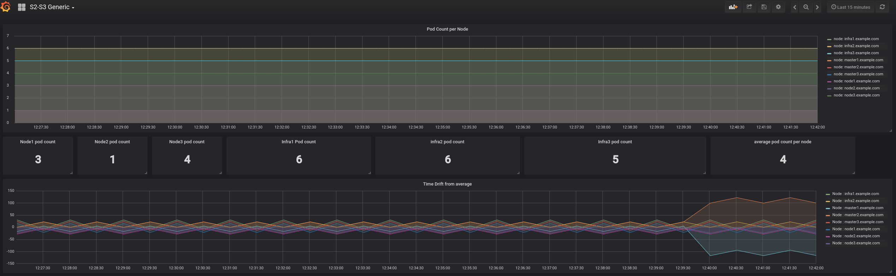

### Problem to solve

```
Complexity: Low
Length: 10-15 min
Dashboard: Labs Generic
```

In this lab we will see how external factors to the `etcd` cluster can impact the OpenShift Container Platforms behaviour and how we can recover from it.

To start scenario:
```
lab -s 1 -a init
```

No direct impact to the OpenShift Container Platform (OCP) cluster may be immediately noticeable, but dashboards and alerts might help you :)


Useful commands for this lab:

```
journalctl -fu <service_name>                        # follow logs of the service
chronyc -a 'burst 4/4' && chronyc -a makestep        # force time sync using chronyc
ansible all/masters/infras/ -m shell -a "hostname"   # execute adhoc command on subset of servers
```

### Solution

#### Task solution

This scenario is one the more common issues seen in customer environments. Distributed systems are very sensitive to time drifts. Even slight time difference can impact all platform performance. This is because one of the metrics used to determine state is time.

#### Check time on all etcd nodes

Execute from the bastion:
```
[root@workstation-repl summit]# ansible etcd -m shell -a "date"
master2.example.com | SUCCESS | rc=0 >>
Mon Mar 26 07:39:17 EDT 2018

master3.example.com | SUCCESS | rc=0 >>
Mon Mar 26 07:40:57 EDT 2018

master1.example.com | SUCCESS | rc=0 >>
Mon Mar 26 07:42:36 EDT 2018
```

This is far from reliable data, but the time difference is noticeable and most likely impacts the OCP cluster. The same information can be observed in grafana:



Because this system is running in isolation, the time drift is calculated based on average of all infrastructure. In a real world deployment, external NTP servers should be used to ensure proper tim sync.

Alerts can be seen for this too:


Solution is straight forward:

Check if time sync / ntp service (chrony) is running:
```
ansible etcd -m shell -a "systemctl status chronyd"
```

Start the service:
```
ansible etcd -m shell -a "systemctl start chronyd"
```

Force time sync:
```
ansible etcd -m shell -a "chronyc -a 'burst 4/4' && chronyc -a makestep"
```

The alerts should resolve, and grafana shows new state:


### Appendix

#### Materials used in the scenario

1. Openshift Documentation on ETCD recovery:
https://docs.openshift.com/container-platform/latest/admin_guide/backup_restore.html

2. Grafana dashboard and Prometheus alert rules:
<insert link to public dasboard link>

3. Etcd (v2) admin guide:
https://coreos.com/etcd/docs/latest/v2/admin_guide.html


### [**-- HOME --**](https://rht-labs-events.github.io/summit-lab-2018-doc/)