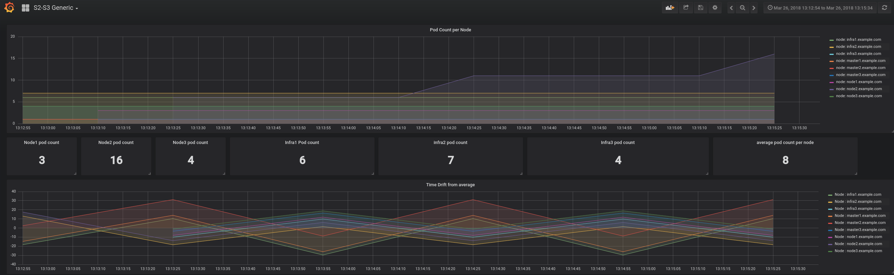

# Scenario 3 - scheduler and limits

```
Complexity: Medium
Length: 10-20 min
Dashboard: Labs Generic
```

In this scenario we will learn basics how openshift scheduler and limits works and how it can impact your platforms behaviour and performance. And why you should care about your scheduler behaviour.

To start this scenario execute command on the bastion:
```
lab -s 3 -a init
```

You should have new project created in your cluster named `scheduler`. Go and investigate it.

```
oc project scheduler
oc get pods

#output example
oc get pods
NAME                      READY     STATUS    RESTARTS   AGE
hello-openshift-1-kfgtg   1/1       Running   0          2m
```

Now lets scale this app to replica 5:
```
oc scale dc/hello-openshift --replicas=5
```

Everything looks fine from the first sight.
```
oc get pods
NAME                      READY     STATUS    RESTARTS   AGE
hello-openshift-1-5vvj2   1/1       Running   0          23s
hello-openshift-1-9q6jh   1/1       Running   0          23s
hello-openshift-1-f9ngm   1/1       Running   0          23s
hello-openshift-1-kfgtg   1/1       Running   0          3m
hello-openshift-1-krx58   1/1       Running   0          23s
```

But lets check deeper. In your case it might be little bit different.
```
oc get pods -o wide
NAME                      READY     STATUS    RESTARTS   AGE       IP            NODE
hello-openshift-1-9b5gl   1/1       Running   0          21s       10.131.1.29   node1.example.com
hello-openshift-1-hwp9g   1/1       Running   0          31s       10.131.1.28   node1.example.com
hello-openshift-1-kczrg   1/1       Running   0          21s       10.131.1.32   node1.example.com
hello-openshift-1-v6jk5   1/1       Running   0          21s       10.131.1.31   node1.example.com
hello-openshift-1-v9vdt   1/1       Running   0          21s       10.131.1.30   node1.example.com
```

We dont see pod distribution. Lets scale more to check more...

```
oc scale dc/hello-openshift --replicas=15
```

You should see the same result. So whats happening? 

First our scheduler does not know how to spread pods over the worker nodes. 
Second, our pid does not have any limits, so again, scheduler does not know "how big is the pod" so it does not know when node is full. 

Dashboards and alerts:



Task 1: Identify why pods are not being spread around the 3 worker nodes.
For this solution DO NOT modify default scheduler or master configs. Everything should be done on the project and node labeling level.

Useful commands:
```
oc label nodes -l label=value - label nodes
oc get nodes --show-labels - check labels
[root@master1 ~]# cat /etc/origin/master/scheduler.json - check scheduler
oc edit namespace scheduler - modify namespace
```

[solution Task 1](solution_part1.md)

[lab Intro](../README.md)

[appendix](appendix.md)

[next lab](../scenario4/part1.md)