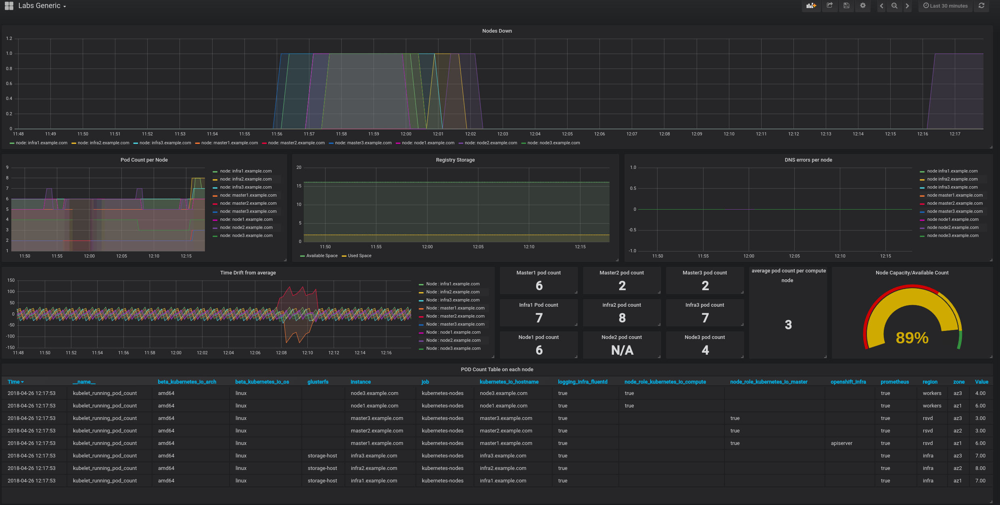

### Problem to solve

```
Complexity: Low
Lenght: 10 min
Dashboards: Labs Generic
```

### Intro

In this lab scenario we will see how the OpenShift Container Platform behaves when losing connectivity to a node due to a SDN (Software-Defined-Network) problem.

The `Labs Generic` Grafana dashboard should show an outage similar to this:

[](https://rht-labs-events.github.io/summit-lab-2018-doc//scenario5/img/lost_node.png)


To start the scenario:
```
> lab -s 5 -a init
```

During this scenario, you will be introduced to the SkyDive tool, :

* SkyDive is an open source, real-time network topology and protocols analyzer.  It aims to provide a comprehensive way of understanding what is happening in the network infrastructure.

* The purpose of using SkyDive in this scenario is to visualize the OpenShift Container Platform Software Defined Network (SDN) to gain a better understanding of how it works.

* SkyDive will show all the SDN related pieces working together: pods, containers, namespaces, virtual switches, interfaces, etc.

To access SkyDive, start by getting the route to the SkyDive console from the `skydive` namespace:

```
> oc -n skydive get route
NAME               HOST/PORT                                             PATH      SERVICES           PORT      TERMINATION   WILDCARD
skydive-analyzer   skydive-analyzer-skydive.apps.129.213.76.166.xip.io             skydive-analyzer   api                     None
```

:heavy_check_mark: Skydive is exposed in port 80, so make sure to use http to access the route instead of https.


[](https://rht-labs-events.github.io/summit-lab-2018-doc//scenario5/img/img2-skydive-general.png)

#### Lab Scenario Goals:

**Spend 1 - 2 minutes becoming familiar with the SkyDive console, just enough to explore the various SDN components.**

**SkyDive is not needed to solve this scenario, but can be useful to better understand the environment.**


* Task 1: Identify why one of your OpenShift Container Platform (OCP) worker nodes is down. Identify which one. Use Grafana dashboard `Labs Generic` and Alertmanager.

* Task 2: Recover the OpenShift Container Platform (OCP) worker node.
 * _**Hint:**_ It seems like a connectivity problem, right? Try starting the service called `atomic-openshift-node` to see what happens.

_**Hint:**_ openvswitch is a key component of the OpenShift SDN.


To start this scenario execute the following command on the `bastion` host:
```
> lab -s 5 -a solve
```

Useful command for this lab scenario:

```
> journalctl -fu <service_name>      # follow logs of the service
> oc get nodes                       # obtain a list of OCP nodes
> oc describe node <node_nae>        # obtain more info for a particular OCP node
```

### Solution

#### Task 1 solution: Identify which worker node is down

The OpenShift Container Platform (OCP) Nodes (atomic-openshift-node/kubelet) send heartbeats periodically to the API. That is how a node reports its status to the master(s) of the OpenShift Container Platform cluster. Healthy nodes should be in a `Ready` state.

Check the OpenShift Container Platform (OCP) cluster nodes by executing `oc get nodes`. A lot more information and the specifics of a particular node can be obtained by running `oc describe node <OCP_NODE>` (replace `<OCP_NODE>` with the actual OCP node name).

Below is an example output for a node, expect to see something similar:

```
> oc describe node node2.example.com
Name:               node2.example.com                                                                                                                                                                                
Roles:              compute                                                                                                                                                                                          
Labels:             beta.kubernetes.io/arch=amd64                                                                                                                                                                    
                    beta.kubernetes.io/os=linux                                                                                                                                                                      
                    kubernetes.io/hostname=node2.example.com                                                                                                                                                         
                    logging-infra-fluentd=true                                                                                                                                                                       
                    node-role.kubernetes.io/compute=true                                                  
                    prometheus=true                  
                    region=workers                   
                    zone=az2                         
Annotations:        volumes.kubernetes.io/controller-managed-attach-detach=true                           
Taints:             <none>                           
CreationTimestamp:  Sat, 31 Mar 2018 05:20:48 -0400  
Conditions:                                          
  Type             Status  LastHeartbeatTime                 LastTransitionTime                Reason                       Message                                                                                  
  ----             ------  -----------------                 ------------------                ------                       -------                                                                                  
  OutOfDisk        False   Sat, 07 Apr 2018 09:10:47 -0400   Sat, 07 Apr 2018 07:02:45 -0400   KubeletHasSufficientDisk     kubelet has sufficient disk space available                                              
  MemoryPressure   False   Sat, 07 Apr 2018 09:10:47 -0400   Sat, 07 Apr 2018 07:02:45 -0400   KubeletHasSufficientMemory   kubelet has sufficient memory available                                                  
  DiskPressure     False   Sat, 07 Apr 2018 09:10:47 -0400   Sat, 07 Apr 2018 07:02:45 -0400   KubeletHasNoDiskPressure     kubelet has no disk pressure                                                             
  Ready            True    Sat, 07 Apr 2018 09:10:47 -0400   Sat, 07 Apr 2018 07:02:55 -0400   KubeletReady                 kubelet is posting ready status                          
```

At this point, the node in a "not Ready" state has been identified, but to verify, also check Grafana, Prometheus and Alertmanager to get more info.

Open the Grafana dashboard `Labs Generic` and check the `Nodes Down` panel.

Something similar to the following should be shown:

[](https://rht-labs-events.github.io/summit-lab-2018-doc//scenario5/img/img3-grafana-nodes-down-panel.png)

Now check both Prometheus and Alertmanager, both of which should show alerts for the node:

[](https://rht-labs-events.github.io/summit-lab-2018-doc//scenario5/img/img1-alerts_alertmanager.png)

Note that apart from the "Node Down" alert, there are two scheduler related alerts. The reason is that nodes 1 & 3 have more Pods than they should, as the Pods from "not ready" node 2 have been re-scheduled into those extra nodes. This is due to a configured alert to be raised on un-even Pod distribution situations.

[](https://rht-labs-events.github.io/summit-lab-2018-doc//scenario5/img/img1-prometheus-alerts.png)

As seen above, node 2 is down. Next steps is to start troubleshooting why and resolve the issue(s).

Start by accessing the node with ssh, and check the status of the `atomic-openshift-node` service:

```
> ssh node2.example.com
> systemctl status atomic-openshift-node
```

From the output, it can be seen that the service is stopped. Next also check the `openvswitch` service:

```
> ssh node2.example.com             # Only needed if not already logged in to the node
> systemctl status openvswitch
```

As the output shows, this service is stopped as well.

#### Task 2 solution: Make node ready again

Now that the root cause (or at least parts of it) has been identified, attempt to start the `atomic-openshift-node` service again.

```
> systemctl start atomic-openshift-node
```

There is no need to start each service independently. The `atomic-openshift-node` systemd service has `openvswitch` as one of its dependencies, so when `atomic-openshift-node` is started, `openvswitch` service is started too.

Next, check that the `openvswitch` service has been started as part of starting the `atomic-openshift-node` service. The output should show somathing similar to the example below:

```
> systemctl status openvswitch
● openvswitch.service
   Loaded: loaded (/etc/systemd/system/openvswitch.service; enabled; vendor preset: disabled)
  Drop-In: /etc/systemd/system/openvswitch.service.d
           └─01-avoid-oom.conf
   Active: active (running) since Thu 2018-04-19 12:33:27 EDT; 2min 38s ago
  Process: 2125 ExecStartPost=/usr/bin/sleep 5 (code=exited, status=0/SUCCESS)
  Process: 2110 ExecStartPre=/usr/bin/docker rm -f openvswitch (code=exited, status=1/FAILURE)
 Main PID: 2124 (docker-current)
    Tasks: 12
   Memory: 2.0M
   CGroup: /system.slice/openvswitch.service
           └─2124 /usr/bin/docker-current run --name openvswitch --rm --privileged --net=host --pid=host -v /lib/modules:/lib/modules -v /run:/run -v /sys:/sys:ro -v /etc/origin/openvswitch:/etc/openvswitch ope...

Apr 19 12:33:22 node1.example.com systemd[1]: Starting openvswitch.service...
Apr 19 12:33:22 node1.example.com openvswitch[2110]: Error response from daemon: No such container: openvswitch
Apr 19 12:33:27 node1.example.com systemd[1]: Started openvswitch.service.
Apr 19 12:33:49 node1.example.com openvswitch[2124]: Starting ovsdb-server [  OK  ]
Apr 19 12:33:50 node1.example.com openvswitch[2124]: Configuring Open vSwitch system IDs [  OK  ]
Apr 19 12:33:50 node1.example.com openvswitch[2124]: Inserting openvswitch module [  OK  ]
Apr 19 12:33:51 node1.example.com openvswitch[2124]: Starting ovs-vswitchd [  OK  ]
Apr 19 12:33:52 node1.example.com openvswitch[2124]: Enabling remote OVSDB managers [  OK ]
```

Finally, navigate back to Grafana, Prometheus and Alertmanager. No more alerts should be visible:

:heavy_check_mark: Alertmanager alerts usually take a while to disappear, so expect around a 5-10 min delay.

:exclamation: There is a known [issue](https://github.com/openshift/origin/issues/19466) related to SkyDive where Pod interfaces are not cleaned. To work around this, please use the lab cli to resolve this scenario and remove SkyDive:

```
> lab -s 5 -a solve
```

### OVS Deep dive

All traffic in the OpenShift OVS based plugins can be inspected even more. On a node of your choice execute:

```
> docker exec openvswitch ovs-ofctl -O OpenFlow13 dump-flows br0
```

The output should show all flows for this particular node, as an example:
```
OFPST_FLOW reply (OF1.3) (xid=0x2):
 cookie=0x0, duration=578.553s, table=0, n_packets=0, n_bytes=0, priority=250,ip,in_port=2,nw_dst=224.0.0.0/4 actions=drop

 cookie=0x0, duration=578.521s, table=10, n_packets=0, n_bytes=0, priority=0 actions=drop
 cookie=0x0, duration=158.408s, table=20, n_packets=0, n_bytes=0, priority=100,arp,in_port=73,arp_spa=10.129.2.132,arp_sha=00:00:0a:81:02:84/00:00:ff:ff:ff:ff actions=load:0x135688->NXM_NX_REG0[],goto_table:21
 cookie=0x0, duration=578.446s, table=30, n_packets=0, n_bytes=0, priority=25,ip,nw_dst=224.0.0.0/4 actions=goto_table:110
 cookie=0x0, duration=578.424s, table=40, n_packets=0, n_bytes=0, priority=0 actions=drop
 cookie=0x0, duration=577.587s, table=50, n_packets=0, n_bytes=0, priority=100,arp,arp_tpa=10.129.0.0/23 actions=move:NXM_NX_REG0[]->NXM_NX_TUN_ID[0..31],set_field:192.168.0.12->tun_dst,output:1
 cookie=0x0, duration=578.418s, table=50, n_packets=0, n_bytes=0, priority=0 actions=drop
 cookie=0x0, duration=578.412s, table=60, n_packets=0, n_bytes=0, priority=200,reg0=0 actions=output:2
 cookie=0x0, duration=577.758s, table=60, n_packets=0, n_bytes=0, priority=100,ip,nw_dst=172.30.49.239,nw_frag=later actions=load:0->NXM_NX_REG1[],load:0x2->NXM_NX_REG2[],goto_table:80
 cookie=0x0, duration=578.406s, table=60, n_packets=0, n_bytes=0, priority=0 actions=drop
 cookie=0x0, duration=158.385s, table=70, n_packets=0, n_bytes=0, priority=100,ip,nw_dst=10.129.2.132 actions=load:0x135688->NXM_NX_REG1[],load:0x49->NXM_NX_REG2[],goto_table:80
 cookie=0x0, duration=578.393s, table=80, n_packets=0, n_bytes=0, priority=300,ip,nw_src=10.129.2.1 actions=output:NXM_NX_REG2[]
 cookie=0x0, duration=578.369s, table=101, n_packets=0, n_bytes=0, priority=51,tcp,nw_dst=192.168.0.32,tp_dst=53 actions=output:2
 cookie=0x0, duration=578.365s, table=101, n_packets=0, n_bytes=0, priority=51,udp,nw_dst=192.168.0.32,tp_dst=53 actions=output:2
 cookie=0x0, duration=578.356s, table=101, n_packets=0, n_bytes=0, priority=0 actions=output:2
```

The rules are complicated and can be hard to read. For now, all you need to focus on is the high level structure of the tables.

For example, some of the rules:

```
Table 10: VXLAN ingress filtering; filled in by AddHostSubnetRules()
Table 21: from OpenShift container; NetworkPolicy plugin uses this for connection tracking
Table 30: general routing
Table 40: ARP to local container, filled in by setupPodFlows
Table 101: egress network policy dispatch; edited by UpdateEgressNetworkPolicy()
```

If a misbehavior is observed, for example EgressNetworkPolicy does not work as expected, or for other reasons it may need to be inspected. By knowing how to dump the rules, and where to look, you can validate if the operation is working or not:

### Appendix

#### Materials used in the scenario

1. OpenShift Container Platform SDN Docs:
https://docs.openshift.com/container-platform/3.9/architecture/networking/sdn.html

2. SkyDive Docs:
http://skydive-project.github.io/skydive/

3. Code documentation of OVS rules:
https://github.com/openshift/origin/blob/c3d0a824b503091f5aa81c88954f218c8f6d6937/pkg/network/node/ovscontroller.go


### [**-- HOME --**](https://rht-labs-events.github.io/summit-lab-2018-doc/)
