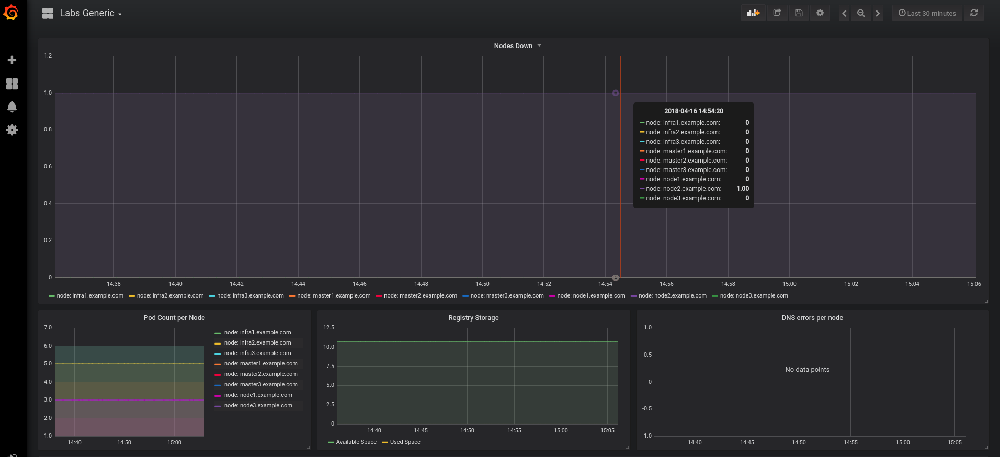
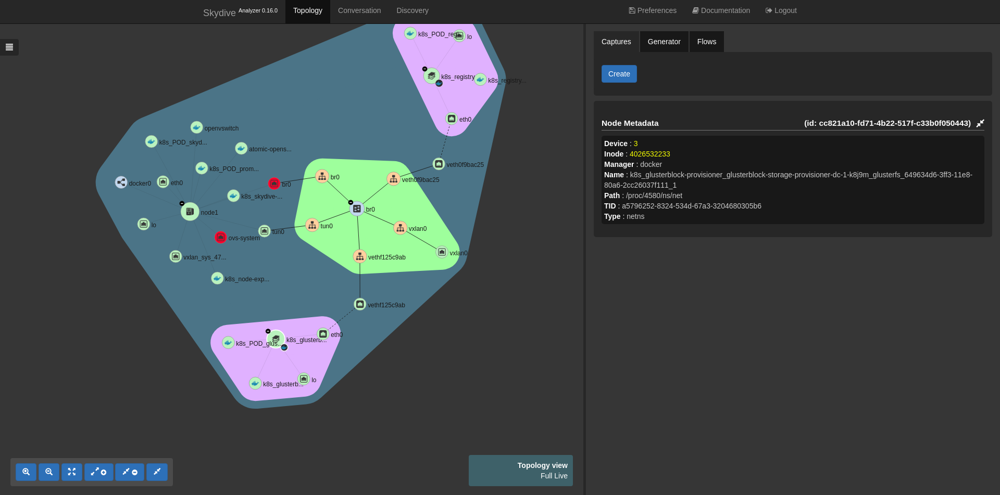
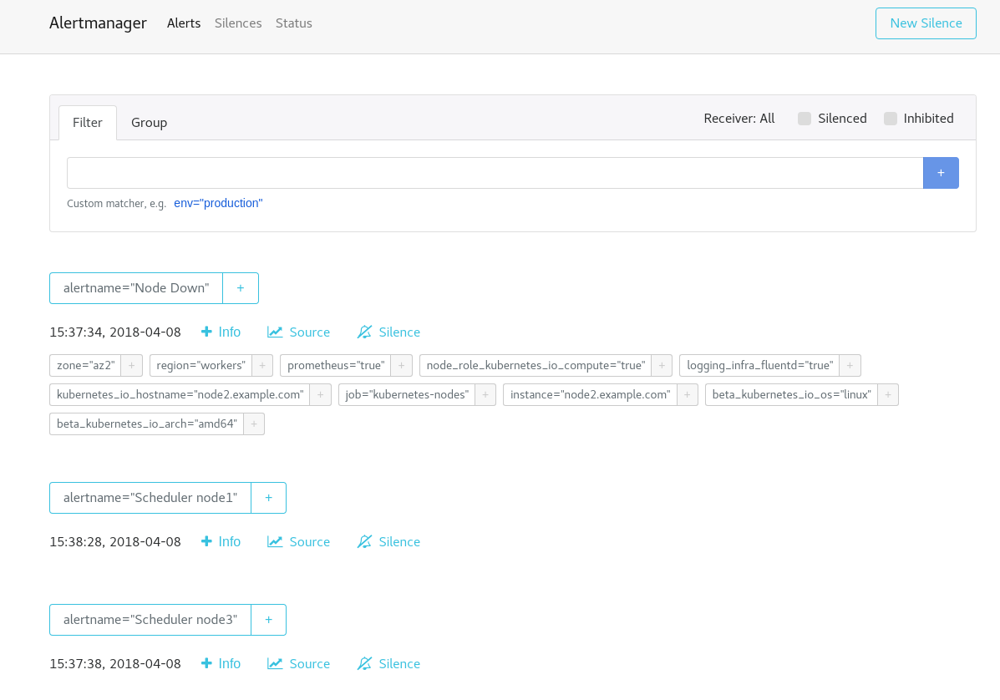

### Problem to solve

```
Complexity: Low
Lenght: 10 min
Dashboards: Labs Generic
```

In this lab we will see how OpenShift behaves when losing connectivity to a node due to a SDN problem.

You should see something like this in the `Labs Generic` Grafana dashboard:



Try to guess what would happen, so at the end of the scenario you could validate if your reasoning was right or wrong ;).

As a bonus, you will be introduced to SkyDive tool:

* An open source real-time network topology and protocols analyzer.  It aims to provide a comprehensive way of understanding what is happening in the network infrastructure.

* The aim of using SkyDive in this scenario is to give you the opportunity to visualize OpenShift SDN and a better understanding of how it works. 

* You could see all SDN pieces working together: pods, containers, namespaces, virtual switches, interfaces, etc.

SkyDive console is pretty cool. Get the route to the console from `skydive` namespace:

```
oc -n skydive get route
NAME               HOST/PORT                                             PATH      SERVICES           PORT      TERMINATION   WILDCARD
skydive-analyzer   skydive-analyzer-skydive.apps.129.213.76.166.xip.io             skydive-analyzer   api                     None
```

**NOTE:
Skydive is exposed in port 80, so use http to access the route instead of https.**





To start the scenario:
```
lab -s 5 -a init
```

#### Lab Goal:

**You can spend 1 or 2 minutes checking SkyDive console, just to see all SDN pieces working together.**

**You won't need SkyDive to solve this scenario though ;). It is just a visualization tool.**


* Task 1: Identify why one of your nodes is down. Identify which one. Use Grafana dashboard `Labs Generic` and Alertmanager.

* Task 2: Make your node ready again. It seems like a connectivity problem, right? Try to start the service `atomic-openshift-node` and see what happens.

* Hint 1: openvswitch is a key component of the OpenShift SDN.


If you want to skip these task, execute on the <b>bastion</b>
```
 lab -s 5 -a solve
```

Useful command for this lab:

```
journalctl -fu <service_name> - follow logs of the service
oc get nodes 
oc describe node <node_nae>
```

### Solution

#### Task 1 solution: Identify node down

nodes (atomic-openshift-node/kubelet) sends heartbeats periodically to the API. Thats how a node reports its status to the cluster. Healthy nodes should be in `Ready` status.

You can check your cluster nodes by executing `oc get nodes`. You can check one particular node by running `oc describe node <OCP_NODE>` to one of the nodes of your cluster. Actually this command gives you a lot more information of the node.

Here it is the example output of the node, expect to see something similar:

```
oc describe node2.example.com
Name:               node2.example.com                                                                                                                                                                                
Roles:              compute                                                                                                                                                                                          
Labels:             beta.kubernetes.io/arch=amd64                                                                                                                                                                    
                    beta.kubernetes.io/os=linux                                                                                                                                                                      
                    kubernetes.io/hostname=node2.example.com                                                                                                                                                         
                    logging-infra-fluentd=true                                                                                                                                                                       
                    node-role.kubernetes.io/compute=true                                                  
                    prometheus=true                  
                    region=workers                   
                    zone=az2                         
Annotations:        volumes.kubernetes.io/controller-managed-attach-detach=true                           
Taints:             <none>                           
CreationTimestamp:  Sat, 31 Mar 2018 05:20:48 -0400  
Conditions:                                          
  Type             Status  LastHeartbeatTime                 LastTransitionTime                Reason                       Message                                                                                  
  ----             ------  -----------------                 ------------------                ------                       -------                                                                                  
  OutOfDisk        False   Sat, 07 Apr 2018 09:10:47 -0400   Sat, 07 Apr 2018 07:02:45 -0400   KubeletHasSufficientDisk     kubelet has sufficient disk space available                                              
  MemoryPressure   False   Sat, 07 Apr 2018 09:10:47 -0400   Sat, 07 Apr 2018 07:02:45 -0400   KubeletHasSufficientMemory   kubelet has sufficient memory available                                                  
  DiskPressure     False   Sat, 07 Apr 2018 09:10:47 -0400   Sat, 07 Apr 2018 07:02:45 -0400   KubeletHasNoDiskPressure     kubelet has no disk pressure                                                             
  Ready            True    Sat, 07 Apr 2018 09:10:47 -0400   Sat, 07 Apr 2018 07:02:55 -0400   KubeletReady                 kubelet is posting ready status                          
```

Although you should already know which node is down, you should also check Grafana, Prometheus and Alertmanager to get more info.

So open Grafana dashboard `Labs Generic` and check the `Nodes Down` panel.

You should see something like this:


Now check both Prometheus and Alertmanager. You should have alerts in both:



Note that apart from the "Node Down" alert you have two scheduler related alerts. The reason is that nodes 1 & 3 have more Pods than they should, as the Pods from node 2 have been re-scheduled into those nodes.

This a configured alert to raise un-even Pod distribution situations in your cluster nodes ;).


Now that we now that node 2 is down, we have to discover what is not working properly.

Let's ssh into it, and check the status of the `atomic-openshift-node`:

```
ssh node2.example.com
systemctl status atomic-openshift-node
```

As you can see, the service is stopped.

#### Task 2 solution: Make node ready again

No that we know what is happening, start the service again.

```
systemctl start atomic-openshift-node
```

But wait, the service is not starting. 

The reason is that the `openvswitch` service is stopped too. Actually `atomic-openshift-node` systemd unit has `openvswitch` as one of its dependencies, so when `openvswitch` is stopped, `atomic-openshift-node` service is stopped too.

 ```
systemctl status openvswitch
● openvswitch.service
   Loaded: loaded (/etc/systemd/system/openvswitch.service; enabled; vendor preset: disabled)
  Drop-In: /etc/systemd/system/openvswitch.service.d
           └─01-avoid-oom.conf
   Active: inactive (dead) since Tue 2018-04-17 05:47:13 EDT; 2s ago
  Process: 17568 ExecStop=/usr/bin/docker stop openvswitch (code=exited, status=0/SUCCESS)
  Process: 14778 ExecStartPost=/usr/bin/sleep 5 (code=exited, status=0/SUCCESS)
  Process: 14777 ExecStart=/usr/bin/docker run --name openvswitch --rm --privileged --net=host --pid=host -v /lib/modules:/lib/modules -v /run:/run -v /sys:/sys:ro -v /etc/origin/openvswitch:/etc/openvswitch openshift3/openvswitch:${IMAGE_VERSION} (code=exited, status=0/SUCCESS)
  Process: 14769 ExecStartPre=/usr/bin/docker rm -f openvswitch (code=exited, status=1/FAILURE)
 Main PID: 14777 (code=exited, status=0/SUCCESS)

Apr 17 05:27:27 node2.example.com openvswitch[14777]: Starting ovsdb-server [  OK  ]
Apr 17 05:27:27 node2.example.com openvswitch[14777]: Configuring Open vSwitch system IDs [  OK  ]
Apr 17 05:27:27 node2.example.com openvswitch[14777]: Starting ovs-vswitchd [  OK  ]
Apr 17 05:27:27 node2.example.com openvswitch[14777]: Enabling remote OVSDB managers [  OK  ]
Apr 17 05:27:31 node2.example.com systemd[1]: Started openvswitch.service.
Apr 17 05:47:11 node2.example.com systemd[1]: Stopping openvswitch.service...
Apr 17 05:47:12 node2.example.com openvswitch[14777]: Exiting ovs-vswitchd (14901) [  OK  ]
Apr 17 05:47:13 node2.example.com openvswitch[14777]: Exiting ovsdb-server (14891) [  OK  ]
Apr 17 05:47:13 node2.example.com openvswitch[17568]: openvswitch
Apr 17 05:47:13 node2.example.com systemd[1]: Stopped openvswitch.service.

```

Now start both services, in the proper order:
```
systemctl start openvswitch
systemctl start atomic-openshift-node
```

Check again Grafana, Prometheus and Alertmanager. You should not see any alerts.

**Note:
Alertmanager alerts usually take a while to disappear, so expect around 5-10 min delay.**
 
### Appendix

#### Materials used in the scenario

1. OpenShift SDN Docs:
https://docs.openshift.com/container-platform/3.9/architecture/networking/sdn.html

2. SkyDive Docs:
http://skydive-project.github.io/skydive/