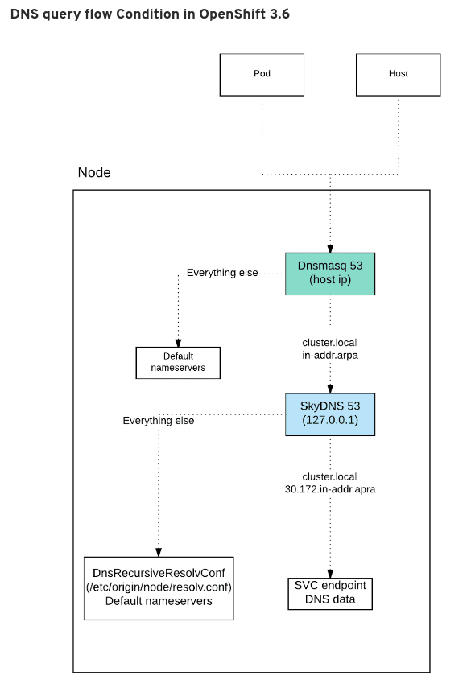
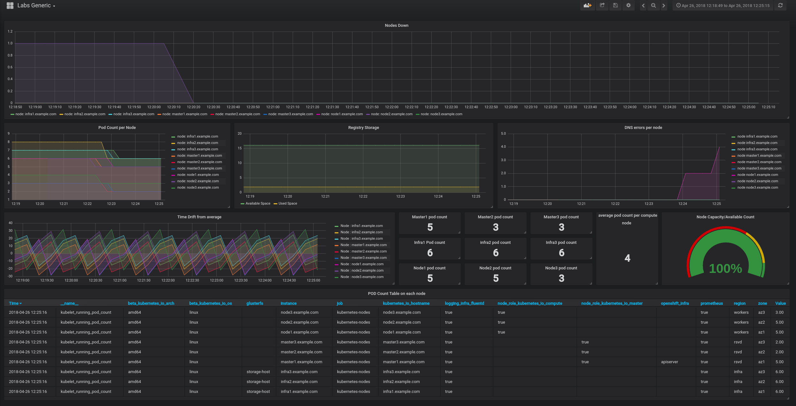
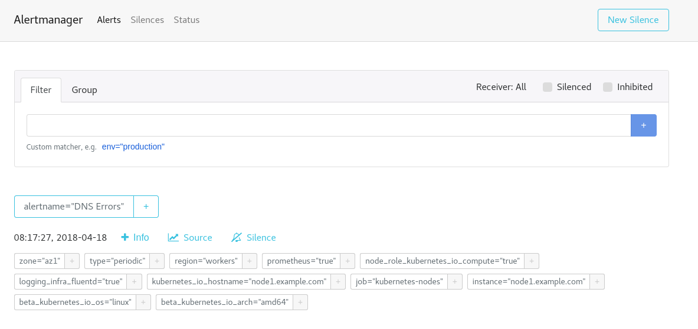
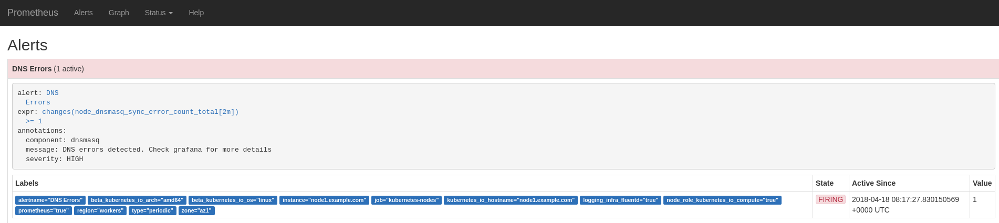

### Problem to solve

```
Complexity: Low
Lenght: 15 min
Dashboards: Labs Generic
```

On this lab we will simulate a common problem usually found in customers. DNS problems ;).
Apps are very sensitive to DNS problems, which are hard to debug.

If you want to know how DNS configuration works in OpenShift, have a look at this [article](https://www.redhat.com/en/blog/red-hat-openshift-container-platform-dns-deep-dive-dns-changes-red-hat-openshift-container-platform-36).

Here it is the DNS architecture diagram of an OpenShift node:



A tricky thing about DNS problems, as you may already know, is that your cluster will look fine while your Apps might be impacted.

To start the scenario:
```
lab -s 6 -a init
```

#### Lab Goal:

* Task 1: Identify which node is impacted and why.

* Task 2: Identify which component or components are impacted. Fix it ;)

* Hint 1: dnsmasq is a key component of the OpenShift DNS architecture.


If you want to skip this task, execute on the <b>bastion</b>:
```
lab -s 6 -a solve
```

Useful commands for this lab:

```
systemctl status/stop <service_name>
journalctl -fu <service_name> - follow logs of the service
oc get nodes
dig
ss -ntlp
```

### Solution

#### Task 1 solution: Identify which node is impacted, and why.

At first sight, all OpenShift nodes are fine. If you run `oc get nodes`,
you should see nothing wrong.

Let's use our monitoring tools, go check Grafana, Prometheus and Alertmanager to get more info. Open Grafana dashboard `Labs Generic` and check the `DNS errors per node` panel.

So, you should see something like this in the `Labs Generic` Grafana dashboard (DNS errors per node graph):



This Grafana panel gives you enough information to know which node is having DNS problems, but still, go check Prometheus and Alertmanager too.

You should have alerts in both:





Now that we now that node 1 is impacted, we have to discover what is not working properly.

#### Task 2 solution: Identify which component or components are impacted. Fix it.

Let's ssh into the node, and check the DNS resolution keeping in mind to the diagram above. So, lets try to resolve Kubernetes api service `kubernetes.default.svc.cluster.local` and see what we get.

First we ask the SkyDNS embedded in the OpenShift node service (127.0.0.1:53) and then the dnsmasq (<node_ip>:53).

```
ssh node1.example.com

dig @127.0.0.1 kubernetes.default.svc.cluster.local +short
172.30.0.1
```

So, SkyDNS is resolving properly, lets see dnsmasq. Get node ip:

```
ip a s eth0
2: eth0: <BROADCAST,MULTICAST,UP,LOWER_UP> mtu 1500 qdisc pfifo_fast state UP qlen 1000
    link/ether 2c:c2:60:0a:fc:82 brd ff:ff:ff:ff:ff:ff
    inet 192.168.0.31/16 brd 192.168.255.255 scope global dynamic eth0
       valid_lft 341277sec preferred_lft 341277sec
    inet6 fe80::2ec2:60ff:fe0a:fc82/64 scope link
       valid_lft forever preferred_lft forever

```

Ask dnsmasq:

```
dig @192.168.0.31 kubernetes.default.svc.cluster.local +short
....
```

Dnsmasq is not even responding, so check the status of the service.

```
systemctl status dnsmasq
● dnsmasq.service - DNS caching server.
   Loaded: loaded (/usr/lib/systemd/system/dnsmasq.service; enabled; vendor preset: disabled)
   Active: inactive (dead) since Wed 2018-04-18 04:15:54 EDT; 4h 41min ago
  Process: 1056 ExecStart=/usr/sbin/dnsmasq -k (code=exited, status=0/SUCCESS)
 Main PID: 1056 (code=exited, status=0/SUCCESS)

Apr 18 03:57:31 node1.example.com dnsmasq[1056]: using nameserver 127.0.0.1#53 for domain cluster.local
Apr 18 03:57:33 node1.example.com dnsmasq[1056]: setting upstream servers from DBus
Apr 18 03:57:33 node1.example.com dnsmasq[1056]: using nameserver 127.0.0.1#53 for domain cluster.local
Apr 18 03:57:33 node1.example.com dnsmasq[1056]: using nameserver 127.0.0.1#53 for domain in-addr.arpa
Apr 18 03:57:33 node1.example.com dnsmasq[1056]: using nameserver 192.168.0.1#53
Apr 18 03:57:33 node1.example.com dnsmasq[1056]: using nameserver 127.0.0.1#53 for domain in-addr.arpa
Apr 18 03:57:33 node1.example.com dnsmasq[1056]: using nameserver 127.0.0.1#53 for domain cluster.local
Apr 18 04:15:54 node1.example.com systemd[1]: Stopping DNS caching server....
Apr 18 04:15:54 node1.example.com dnsmasq[1056]: exiting on receipt of SIGTERM
Apr 18 04:15:54 node1.example.com systemd[1]: Stopped DNS caching server..
```

Dnsmasq was stopped, start it and check the DNS resolution again.

```
systemctl start dnsmasq

dig @192.168.0.31 kubernetes.default.svc.cluster.local +short
172.30.0.1
```

Check again Grafana, Prometheus and Alertmanager. You should not see any alerts.

:heavy_check_mark: Alertmanager alerts usually take a while to disappear, so expect around 5-10 min delay.**

### Appendix

#### Materials used in the scenario

1. OpenShift DNS Docs:
https://docs.openshift.com/container-platform/3.9/architecture/networking/networking.html#architecture-additional-concepts-openshift-dns

2. OpenShift DNS Deep dive:
https://www.redhat.com/en/blog/red-hat-openshift-container-platform-dns-deep-dive-dns-changes-red-hat-openshift-container-platform-36


### [**-- HOME --**](https://rht-labs-events.github.io/summit-lab-2018-doc/)